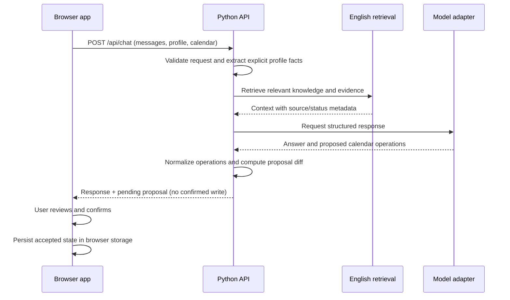

# Shanghai Relocation Agent

**Full-stack AI web application prototype** built with Python and vanilla JavaScript. The project demonstrates a browser-to-API workflow for retrieval-grounded assistance and safe, user-confirmed calendar updates.

[](https://github.com/Chang0610/Relocation-Agent-/actions/workflows/ci.yml)

> This repository is a local/demo prototype, not a production service. It has no authentication, server-side user database, or multi-user isolation. Do not use real personal data.

## Engineering highlights

- **End-to-end request flow:** browser client → bounded JSON API → profile extraction and English knowledge retrieval → structured model response → validated calendar proposal → explicit user confirmation → browser persistence.
- **Safe state transitions:** calendar operations are normalized and checked for duplicates, dependencies, date ordering, and hard-deadline conflicts. The API returns a proposal; confirmed state changes only after the user confirms it in the browser.
- **Evidence-aware retrieval:** runtime JSON records retain source URLs and evidence status. Retrieval distinguishes verified facts from items that still require confirmation; the assistant is instructed not to upgrade uncertain source data into definitive claims.
- **Deterministic demo mode:** run the complete UI without an API key or model request, with fictional seed data and a separate browser-storage namespace.
- **Automated regression checks:** Python unit and HTTP integration tests plus Node.js tests for frontend parsing, proposal order, and persistence failure behavior. GitHub Actions runs these checks without billable API calls.

## Stack

| Layer | Implementation |
| --- | --- |
| Browser | Semantic HTML, CSS, vanilla JavaScript, browser local storage |
| API | Python 3 standard library HTTP server; JSON request/response contract |
| AI / retrieval | OpenAI-compatible model adapter; local English JSON knowledge retrieval |
| Validation | Python `unittest`, local HTTP integration tests, Node.js regression scripts |
| CI | GitHub Actions; Python 3.11 and Node.js 20 |

## Architecture



More detail: [Architecture](docs/ARCHITECTURE.md) · [API contract](docs/API.md) · [Testing](docs/TESTING.md).

## Run locally

Requirements: Python 3.11+ and Node.js 20+ for the full test suite. The backend uses only the Python standard library.

Start the deterministic demo (no key, no model calls):

```bash
DEMO_MODE=1 python3 backend/server.py
```

Open <http://127.0.0.1:8765/>. The demo uses fictional data, isolated browser storage, and does not persist feedback on the server.

For model-backed local development, create `.env.local` from the example and add a server-side key:

```bash
cp .env.local.example .env.local
# Set OPENAI_API_KEY in .env.local; never put it in browser code or commit it.
python3 backend/server.py
```

The default API binds to localhost. It is not ready for public deployment.

## Verify

Run the same deterministic checks used by CI:

```bash
python3 -m unittest discover -s tests -p 'test_*.py' -v
node tests/test_frontend_english.cjs
node tests/test_frontend_persistence.cjs
python3 -m py_compile backend/*.py tests/*.py
```

The latest local run passed 138 Python tests and both frontend checks. The optional model-backed QA/live smoke scripts can incur API charges and are not run in CI.

## Repository map

```text
backend/     HTTP API, retrieval, model adapter, profile and calendar logic
data/        English runtime knowledge, area data, task templates
preview/     Browser UI, English strings, styles and client state
tests/       Unit, HTTP integration, scenario and frontend regression tests
docs/        Architecture, API, test strategy, demo and release notes
```

The English runtime data is included; the source PRD/research documents and original Chinese project are intentionally not included. See [Publishing notes](PUBLISHING.md) for language scope and attribution review.

## Known engineering gaps

- No authentication, authorization, server-side persistence, or cross-device sync.
- No production rate/spend limits, privacy-safe observability, deployment pipeline, or operational recovery process.
- Desktop accessibility, browser compatibility, and full offline/error-recovery acceptance remain open.
- Knowledge source attribution and third-party redistribution terms should be reviewed before reuse.

This is best described as a **full-stack AI prototype**, not a deployed or production-ready system. See [Portfolio case study](docs/PORTFOLIO.md) and [Release checklist](docs/RELEASE_CHECKLIST.md).
