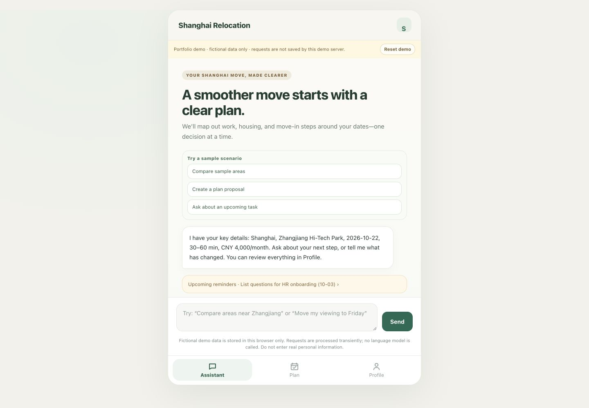
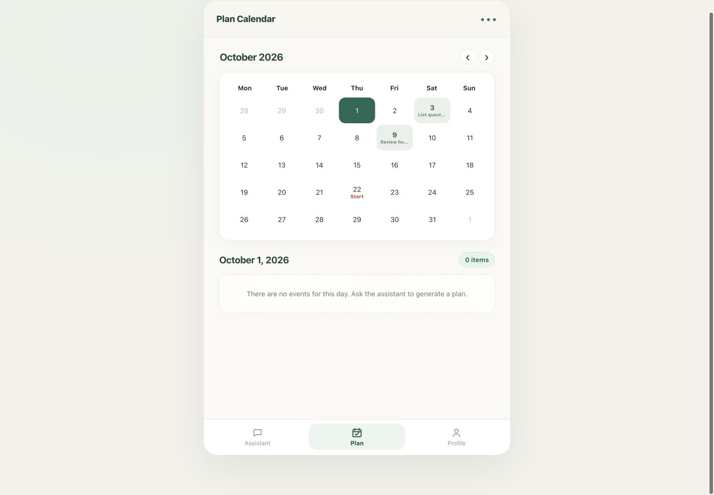
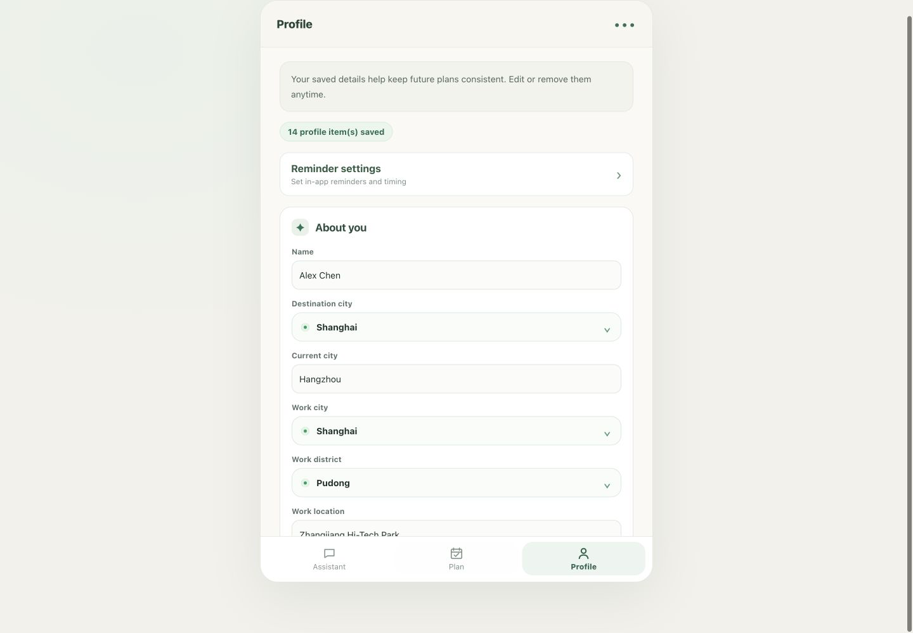

# Shanghai Relocation Agent — Portfolio Case Study

## Project summary

An English-first relocation-planning web app for people moving to Shanghai for work. The assistant organizes user-provided context into a source-aware plan and calendar proposal. The user reviews every proposed change; confirmed events are not modified until the user chooses to confirm.

This is a focused relocation agent, not a general-purpose agent builder. The portfolio build includes a deterministic demo mode that works without an API key and uses fictional data only.

## Product and engineering work

- Translated a relocation-planning problem into an English web experience with Assistant, Plan Calendar, and Profile surfaces.
- Built a Python HTTP backend and browser client, with English retrieval data separated from the supplied source materials and original PRD.
- Added structured response and calendar-operation validation, date/dependency handling, duplicate prevention, hard-deadline conflict protection, and a review-before-write workflow.
- Added a deterministic showcase mode with a fictional profile/calendar, isolated browser storage, no model-provider calls, and no server-side feedback persistence.
- Added regression coverage for the English PRD scenarios, API boundaries, calendar safety, retrieval evidence status, browser behavior, and persistence.

## Architecture and stack

- **Frontend:** semantic HTML, CSS, and vanilla JavaScript; browser-local state for the current prototype.
- **Backend:** Python standard-library HTTP server, English knowledge retrieval, request validation, model adapter, and calendar proposal pipeline.
- **Data:** Curated English runtime knowledge, area data, and task templates. The source PRD and research files are intentionally not redistributed in this release copy.
- **Safety:** proposed calendar changes remain pending until explicit confirmation; source uncertainty remains visible; the portfolio demo disables model calls and uses a separate storage namespace.
- **Testing:** Python `unittest`, Node.js frontend regression scripts, and a separate opt-in model-backed scenario runner.

## Portfolio demo

Run from this directory:

```bash
DEMO_MODE=1 python3 backend/server.py
```

Open `http://127.0.0.1:8765/`. No API key is needed. Use only the fictional sample profile. Demo answers and dates are scripted examples, not live policy guidance or an evaluation of model quality. See [Demo Guide](DEMO_GUIDE.md) and [Testing Guide](TESTING.md).

## Verification

At the latest recorded regression run, 130 deterministic Python tests and 8 local HTTP integration tests passed. The English frontend and persistence checks also passed. A narrow 390 × 844 local browser pass covered navigation, profile layout, plan proposal, and proposal dismissal; a wider viewport was used to capture the portfolio screens. The full accessibility, offline-recovery, and desktop acceptance checklist is still open. The model-backed ten-scenario runner is opt-in and may incur API charges; it was not part of the latest deterministic run.

## Screenshots

All images below use fictional demo data and were captured from the local demo build. They are supporting portfolio material, not evidence of a public deployment.







## Resume-ready description

**Shanghai Relocation Agent | Full-stack AI product prototype**

- Built an English-first relocation-planning web app with a Python API, browser client, and evidence-aware retrieval over Shanghai relocation materials.
- Designed a structured calendar proposal workflow with dependency-aware date changes, duplicate prevention, hard-deadline conflict handling, and explicit user confirmation before writes.
- Implemented a no-key portfolio demo mode with fictional seed data, isolated browser storage, deterministic responses, and no model calls; added 138 Python regression tests plus browser-state checks.

These bullets describe the local prototype and tested behavior. Do not describe it as publicly deployed, production-ready, or as a general-purpose agent platform until those milestones are completed.

## Remaining showcase gates

- Complete the desktop and accessibility portions of [Web Acceptance](WEB_ACCEPTANCE.md).
- Decide whether to run the model-backed scenarios after reviewing current API pricing and confirming the configured key/model.
- Connect and publish through a Git provider and hosting account only after the owner resumes the previously deferred GitHub step and reviews provider privacy/logging terms.
- Do not use real user profiles or invite public visitors until hosting and privacy behavior have been reviewed.
